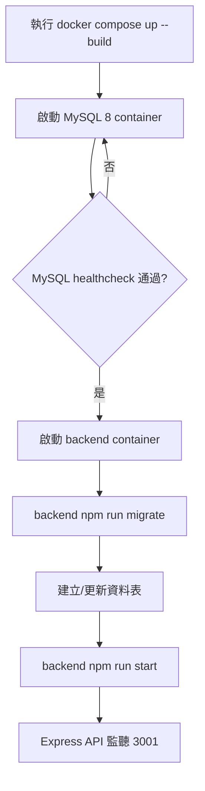
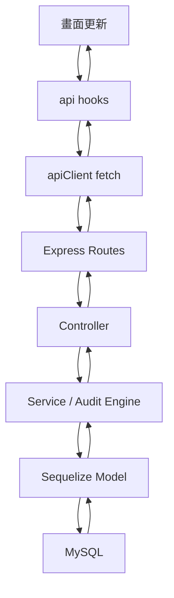
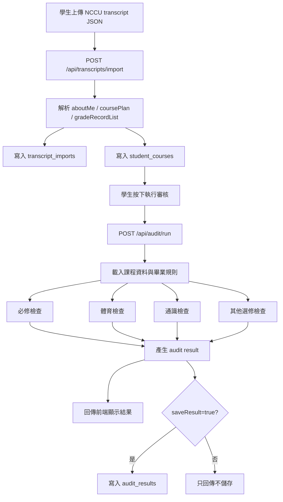
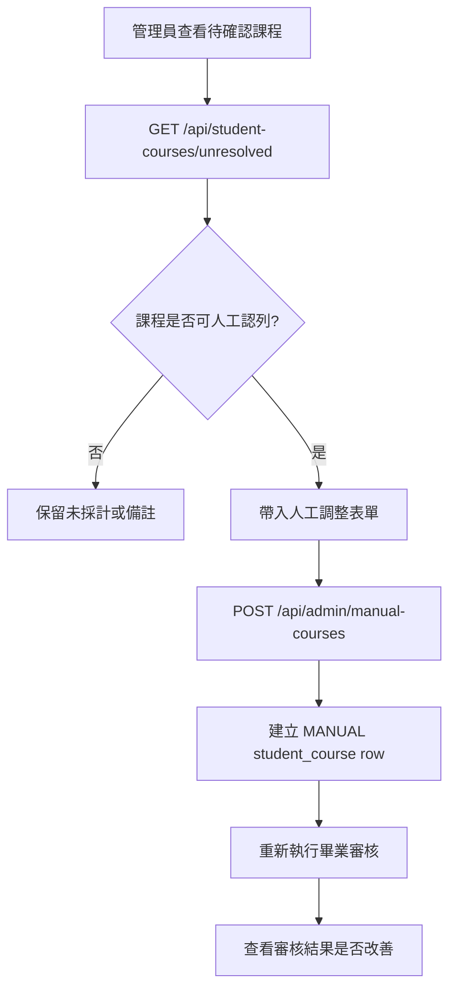

# NCCU AMS 畢業審核系統

這是一個「政大畢業審核系統」課程專題。系統可以讓學生匯入 NCCU transcript JSON，後端依照畢業規則計算是否符合畢業資格，前端再用 dashboard 方式顯示審核結果。

目前專案重點是：

- 學生端：匯入成績 JSON、查看修課資料、執行畢業審核、查看審核結果與歷史紀錄。
- 管理員端：查看待確認課程、建立人工調整、查課程資料、查畢業規則、看學生審核紀錄。
- 後端：Express API + Sequelize + MySQL，負責資料匯入、規則計算、審核結果儲存。
- 前端：React + Vite + TypeScript + Tailwind CSS，負責操作介面與結果呈現。

> 注意：目前登入/註冊是前端展示流程，還不是正式帳號認證系統。若要正式公開使用，需要再補後端 auth、JWT/session、角色權限檢查。

## 技術架構

```text
Frontend
React + Vite + TypeScript + Tailwind CSS

Backend
Node.js + Express + Sequelize

Database
MySQL 8

Container
Docker Compose
```

專案目錄：

```text
nccu-ams-credit-checker/
├── backend/                # Express API、Sequelize models、audit engine
├── frontend/               # React + Vite 前端
├── data/                   # 課程 Excel、demo transcript JSON
├── docs/                   # API、後端設計、假設、效能報告
├── performance/            # k6 壓測腳本
├── docker-compose.yml      # 本機 Docker Compose：MySQL + backend
├── requirement.txt         # 系統需求與功能需求清單
└── README.md
```

## 前後端怎麼接起來

前端不直接碰資料庫，只呼叫後端 API。

```text
使用者操作前端
    ↓
React page / component
    ↓
frontend/src/api/hooks.ts
    ↓
frontend/src/api/client.ts
    ↓
HTTP API request
    ↓
backend/src/routes/*
    ↓
backend/src/controllers/*
    ↓
backend/src/services/*
    ↓
Sequelize models
    ↓
MySQL
```

本機開發時，前端預設呼叫：

```text
http://localhost:3001/api/...
```

如果用 Cloudflare Tunnel 對外 demo，前端會改成呼叫相對路徑：

```text
/api/...
```

再由 Vite dev server proxy 到：

```text
http://localhost:3001
```

這樣外部使用者只需要打開一個網址，不會遇到「外部瀏覽器連不到你本機 localhost:3001」的問題。

## 系統流程圖

### Docker 啟動流程



### 前端到後端的 API 流程



### 從匯入 JSON 到畢業審核



### 管理員人工調整流程



## 畢業規則概要

目前系統採用 128 學分結構：

```text
畢業門檻 128 學分
= 系必修 51 學分
+ 體育必修 4 學分
+ 通識 28 學分
+ 其他選修 45 學分
```

通識規則包含：

```text
中國語文通識課程
外國語文通識課程
人文學通識
社會科學通識
自然科學通識
資訊通識
書院通識
核心通識課程
```

核心通識會清楚列出已通過哪兩門核心領域課程。

## 本機啟動方式

### 1. 啟動後端與 MySQL

專案根目錄執行：

```bash
docker compose up -d --build
```

確認 container 狀態：

```bash
docker compose ps
```

正常會看到：

```text
nccu-ams-mysql     Up / healthy
nccu-ams-backend   Up
```

確認後端健康檢查：

```bash
curl http://localhost:3001/api/health
```

正常回應：

```json
{"status":"ok"}
```

### 2. 第一次啟動後匯入基礎資料

資料庫第一次建立後，需要 seed 課程與 demo 使用者資料：

```bash
docker compose exec backend npm run seed
docker compose exec backend npm run seed:transcript
docker compose exec backend npm run seed:k6-user
```

如果要重設 demo 資料：

```bash
docker compose exec backend npm run reset:demo
```

### 3. 啟動前端

另開一個 terminal：

```bash
cd frontend
npm install
npm run dev
```

前端網址：

```text
http://localhost:5173
```

後端網址：

```text
http://localhost:3001
```

## 免費線上 demo：Cloudflare Tunnel

如果只是要給老師或同學短時間 demo，可以不用買 VPS，直接把本機服務暫時公開出去。

先確認 Docker backend/mysql 已啟動：

```bash
docker compose up -d
curl http://localhost:3001/api/health
```

用 tunnel 模式啟動前端：

```bash
cd frontend
npm run dev -- --mode tunnel --host 0.0.0.0
```

再啟動 Cloudflare Tunnel：

```bash
cloudflared tunnel --url http://localhost:5173
```

如果是 Homebrew 安裝的 cloudflared，也可以用：

```bash
/opt/homebrew/opt/cloudflared/bin/cloudflared tunnel --url http://localhost:5173
```

Cloudflare 會產生一個像這樣的網址：

```text
https://xxxx.trycloudflare.com
```

注意：

- 這是免費 quick tunnel，不保證永久有效。
- 每次重開 tunnel，網址可能會換。
- 你的電腦、Docker、Vite、cloudflared 都要保持開著。

## 常用 API

### 健康檢查

```bash
curl http://localhost:3001/api/health
```

### 匯入 transcript JSON

```http
POST /api/transcripts/import
```

用途：

```text
把 NCCU JSON 成績資料匯入資料庫，建立 transcript_imports 與 student_courses。
```

### 執行畢業審核

```bash
curl -X POST http://localhost:3001/api/audit/run \
  -H 'Content-Type: application/json' \
  -d '{"userId":1,"academicYear":"111","includeInProgress":false,"saveResult":true}'
```

重要參數：

```text
userId：要審核的學生 ID
academicYear：適用學年度，例如 111
includeInProgress：是否把修課中課程放進預估結果
saveResult：是否儲存到 audit_results
```

### 查審核歷史

```http
GET /api/audit/history?userId=1&limit=20
```

### 查待確認課程

```http
GET /api/student-courses/unresolved?userId=1
```

### 建立人工調整

```http
POST /api/admin/manual-courses
```

用途：

```text
讓管理員新增人工認列、抵免或核准替代課程。
```

## 前端頁面

學生端：

```text
/student
/student/import
/student/courses
/student/audit/run
/student/audit/result
/student/audit/history
```

管理員端：

```text
/admin
/admin/unresolved
/admin/manual-courses
/admin/courses
/admin/requirements
/admin/audit-history
```

## 測試與驗證

後端測試：

```bash
cd backend
npm test
```

前端測試：

```bash
cd frontend
npm test
```

前端 build：

```bash
cd frontend
npm run build
```

Docker/API 檢查：

```bash
docker compose ps
curl http://localhost:3001/api/health
curl 'http://localhost:3001/api/courses?year=111&limit=3'
curl 'http://localhost:3001/api/curriculums/113/requirements'
```

壓力測試：

```bash
k6 run performance/k6-audit-test.js
```

