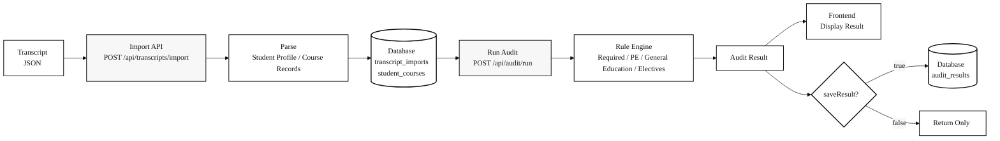
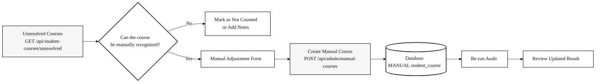
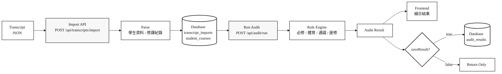
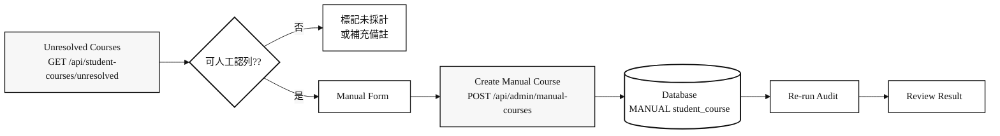

## NCCU Mathematical Sciences Undergraduate Degree Audit Reporting System for Academic Years 111-114

<p align="center">
    
</p>

## Degree Audit Reporting System (DARS)

The Degree Audit Reporting System (DARS) is a computer generated report for undergraduate and associate level students that matches the requirements of a degree program with a student's course work taken. The audit identifies those graduation requirements that are completed as well as those requirements that still need to be completed.

## Introduction 

This repository is the final project for the **114-2 Database Systems** course.

The system allows students to import transcript JSON files downloaded from iNCCU and automatically evaluates whether the student satisfies the graduation requirements of the **NCCU Department of Mathematical Sciences undergraduate program**.

The current system focuses on the following modules:

- **Student Portal**
  - Import transcript JSON files
  - View imported course records
  - Run degree audits
  - View audit results and audit history

- **Admin Portal**
  - Review unresolved courses
  - Create manual course adjustments
  - Query course data
  - Query graduation rules
  - View student audit records

- **Backend**
  - Express API + Sequelize + MySQL
  - Handles transcript import, rule evaluation, audit result persistence, and administrative adjustments

- **Frontend**
  - React + Vite + TypeScript + Tailwind CSS
  - Provides the user interface for transcript import, degree audit execution, and result visualization

> **Security Notice.** The system uses JWT-based authentication and backend role/owner authorization for student transcript, audit, and admin APIs. Because this remains a course/demo deployment, please still avoid uploading real sensitive academic records unless the deployment environment, secrets, database access, and transport security have been reviewed.


## Technology Stack

```text
Frontend:   React + Vite + TypeScript + Tailwind CSS
Backend:    Node.js + Express + Sequelize
Database:   MySQL
Container:  Docker Compose
```


## Project Structure

```text
1142-nccu-database-systems/
├── backend/                # Express API, Sequelize models, audit engine
├── frontend/               # React + Vite frontend application
├── data/                   # Course Excel files and demo transcript JSON files
├── docs/                   # API docs, backend design, assumptions, performance reports
├── performance/            # k6 load testing scripts
├── .env.example            # Docker Compose environment template
├── docker-compose.yml      # Local Docker Compose setup: MySQL + backend
├── requirement.txt         # System requirements and functional requirements
└── README.md
```


## Frontend–Backend Integration

The frontend does not access the database directly.  
All data operations are performed through backend API endpoints.

```text
User interaction
    ↓
React page / component
    ↓
frontend/src/api/hooks.ts
    ↓
frontend/src/api/client.ts
    ↓
HTTP API request
    ↓
backend/src/routes/*
    ↓
backend/src/controllers/*
    ↓
backend/src/services/*
    ↓
Sequelize models
    ↓
MySQL
```

During local development, the frontend calls:

```text
http://localhost:3001/api/...
```

When exposing the system through Cloudflare Tunnel for demo purposes, the frontend calls relative paths:

```text
/api/...
```

These requests are then proxied by the Vite development server to:

```text
http://localhost:3001
```


## System Workflow

The system consists of two major workflows:

1. Students upload transcript JSON files downloaded from iNCCU and run a graduation audit.
2. Administrators review courses that cannot be automatically classified and create manual adjustments.


### Transcript JSON to Degree Audit




### Administrative Manual Adjustment Workflow




## Graduation Requirement Model

The current system adopts a 128-credit graduation structure and evaluates credits according to course categories.

### Credit Structure

| Category | Credits | Description |
|---|---:|---|
| Department Required Courses | 51 | Evaluated according to the NCCU Applied Mathematics undergraduate curriculum |
| Required Physical Education | 4 | Checks whether the required PE credits have been completed |
| General Education | 28 | Evaluates language, core, humanities, social science, natural science, information literacy, and college-level requirements |
| Other Electives | 45 | Remaining countable credits after required courses, PE, and general education credits |
| **Total** | **128** | Minimum graduation credit requirement |


### General Education Requirements

The system checks the following general education categories:

```text
Chinese Language General Education
Foreign Language General Education
Humanities General Education
Social Science General Education
Natural Science General Education
Information Literacy General Education
College General Education
Core General Education
```

For **Core General Education**, the system explicitly lists the core-domain courses that the student has passed, making it easier to verify whether the student satisfies the graduation requirement.


## Environment Requirements

| Tool | Recommended Version |
|---|---|
| Docker Desktop | 4.0+ |
| Node.js | 18.0.0+ |
| npm | 9.0+ |
| k6 | Optional; only required for load testing |
| cloudflared | Optional; only required for Cloudflare Tunnel demos |


## Quick Start

### 1. Create Docker Compose Environment Variables

```bash
cp .env.example .env
```

Open the root `.env` file and configure the actual database password, JWT secret, admin registration secret, frontend URL, and email settings. Email settings are required only if you want forgot-password emails to be delivered.

Docker Compose reads the root `.env` file next to `docker-compose.yml`. Use `backend/.env.example` only when running the backend directly outside Docker Compose, such as `cd backend && npm run dev`.


### 2. Start Backend and MySQL

Run the following command from the project root:

```bash
docker compose up -d --build
```

Check container status:

```bash
docker compose ps
```

Expected output:

```text
nccu-ams-mysql     Up / healthy
nccu-ams-backend   Up
```

Check backend health:

```bash
curl http://localhost:3001/api/health
```

Expected response:

```json
{"status":"ok"}
```


### 3. Seed Initial Data

After the database is created for the first time, import course data, demo transcript data, and test users.

```bash
docker compose exec backend npm run seed
docker compose exec backend npm run seed:transcript
docker compose exec backend npm run seed:k6-user
```

Seeded credentials:

| Role | Account | Password |
|---|---|---|
| Student demo | `demo001` | `demo1234` |
| Admin demo | `admin` | `admin1234` |
| k6 flow user | `k6demo` | `k6demo1234` |

To reset demo data:

```bash
docker compose exec backend npm run reset:demo
```


### 4. Start the Frontend

Open another terminal:

```bash
cd frontend
npm install
npm run dev
```

The services will be available at:

| Service | URL |
|---|---|
| Frontend | `http://localhost:5173` |
| Backend API | `http://localhost:3001` |


## Free Online Demo with Cloudflare Tunnel

This project supports Cloudflare Tunnel for exposing the locally running system through a temporary public URL.

This is useful for course presentations, demos, and remote testing.


### 1. Ensure the Backend Is Running

```bash
docker compose up -d
curl http://localhost:3001/api/health
```


### 2. Start the Frontend in Tunnel Mode

```bash
cd frontend
npm run dev -- --mode tunnel --host 0.0.0.0
```


### 3. Start Cloudflare Tunnel

```bash
cloudflared tunnel --url http://localhost:5173
```

If `cloudflared` was installed through Homebrew, you may also run:

```bash
/opt/homebrew/opt/cloudflared/bin/cloudflared tunnel --url http://localhost:5173
```

After the tunnel starts successfully, Cloudflare will provide a URL similar to:

```text
https://xxxx.trycloudflare.com
```

> **Note**  
> Cloudflare Quick Tunnel provides a free temporary public URL.  
> The URL is not guaranteed to be permanent.  
> Each tunnel restart may generate a different URL.  
> During the demo, the local machine, Docker containers, Vite development server, and `cloudflared` process must remain running.


## Common API Endpoints

Endpoints under `/api/transcripts`, `/api/student-courses`, `/api/audit`, `/api/admin`, and authenticated profile/password routes require a JWT Bearer token. `/api/health`, `/api/courses`, `/api/curriculums`, login, registration, password-reset request, and password-reset token endpoints are public.

Login first and reuse the returned token:

```bash
TOKEN=$(curl -s -X POST http://localhost:3001/api/auth/login \
  -H 'Content-Type: application/json' \
  -d '{"account":"demo001","password":"demo1234"}' \
  | node -e 'let data="";process.stdin.on("data",c=>data+=c);process.stdin.on("end",()=>console.log(JSON.parse(data).token));')

DEMO_USER_ID=$(curl -s http://localhost:3001/api/auth/me \
  -H "Authorization: Bearer $TOKEN" \
  | node -e 'let data="";process.stdin.on("data",c=>data+=c);process.stdin.on("end",()=>console.log(JSON.parse(data).user.id));')
```

For admin-only APIs, login as the seeded admin:

```bash
ADMIN_TOKEN=$(curl -s -X POST http://localhost:3001/api/auth/login \
  -H 'Content-Type: application/json' \
  -d '{"account":"admin","password":"admin1234"}' \
  | node -e 'let data="";process.stdin.on("data",c=>data+=c);process.stdin.on("end",()=>console.log(JSON.parse(data).token));')
```

### Health Check

```bash
curl http://localhost:3001/api/health
```


### Import Transcript JSON

```http
POST /api/transcripts/import
```

Purpose:

```text
Imports transcript data exported from iNCCU,
then creates records in transcript_imports and student_courses.
```


### Run Degree Audit

```bash
curl -X POST http://localhost:3001/api/audit/run \
  -H 'Content-Type: application/json' \
  -H "Authorization: Bearer $TOKEN" \
  -d "{\"userId\":${DEMO_USER_ID},\"academicYear\":\"111\",\"includeInProgress\":false,\"saveResult\":true}"
```

| Parameter | Type | Description |
|---|---|---|
| `userId` | number | Student user ID to audit |
| `academicYear` | string | Applicable academic year, for example `111` |
| `includeInProgress` | boolean | Whether to include currently enrolled courses in the projected result |
| `saveResult` | boolean | Whether to persist the audit result into `audit_results` |


### Query Audit History

```bash
curl "http://localhost:3001/api/audit/history?userId=${DEMO_USER_ID}&limit=20" \
  -H "Authorization: Bearer $TOKEN"
```


### Query Unresolved Courses

```bash
curl "http://localhost:3001/api/student-courses/unresolved?userId=${DEMO_USER_ID}" \
  -H "Authorization: Bearer $TOKEN"
```


### Create Manual Course Adjustment

```http
POST /api/admin/manual-courses
```

This endpoint requires an admin token.

Purpose:

```text
Allows administrators to create manually recognized, waived, transferred,
or approved substitute course records.
```


## Frontend Routes

### Student Portal

| Route | Description |
|---|---|
| `/student` | Student dashboard |
| `/student/import` | Import transcript JSON |
| `/student/courses` | View imported courses |
| `/student/audit/run` | Run degree audit |
| `/student/audit/result` | View audit result |
| `/student/audit/history` | View audit history |
| `/student/profile` | Edit profile and password |


### Admin Portal

| Route | Description |
|---|---|
| `/admin` | Admin dashboard |
| `/admin/students` | Review student accounts, upload status, unresolved courses, and full transcripts |
| `/admin/unresolved` | Review unresolved courses |
| `/admin/manual-courses` | Create manual course adjustments |
| `/admin/courses` | Query course data |
| `/admin/requirements` | View graduation requirements |
| `/admin/audit-history` | View audit records |
| `/admin/profile` | Edit profile and password |

### Auth Routes

| Route | Description |
|---|---|
| `/login` | Login |
| `/register` | Register student or admin account |
| `/forgot-password` | Request password reset email |
| `/reset-password` | Reset password with email token |


## Testing and Validation

### Backend Tests

```bash
cd backend
npm test
```


### Frontend Tests

```bash
cd frontend
npm test
```


### Frontend Production Build

```bash
cd frontend
npm run build
```


### Docker and API Checks

```bash
docker compose ps
curl http://localhost:3001/api/health
curl 'http://localhost:3001/api/courses?year=111&limit=3'
curl 'http://localhost:3001/api/curriculums/113/requirements'
```


### Load Testing

```bash
k6 run performance/k6-audit-test.js
```

The k6 script logs in with seeded users before calling protected APIs and derives the required user ids from the login response. Defaults are `demo001` / `demo1234` for browsing and audit checks, and `k6demo` / `k6demo1234` for the full transcript-import flow.


## Command Reference

| Task | Command |
|---|---|
| Start Docker services | `docker compose up -d --build` |
| Check container status | `docker compose ps` |
| Seed course data | `docker compose exec backend npm run seed` |
| Seed demo transcript | `docker compose exec backend npm run seed:transcript` |
| Create k6 test user | `docker compose exec backend npm run seed:k6-user` |
| Reset demo data | `docker compose exec backend npm run reset:demo` |
| Start frontend | `cd frontend && npm run dev` |
| Run backend tests | `cd backend && npm test` |
| Run frontend tests | `cd frontend && npm test` |
| Build frontend | `cd frontend && npm run build` |
| Run load test | `k6 run performance/k6-audit-test.js` |


## License

This project is developed as a course final project and is intended for academic demonstration and learning purposes only.

---

## 111~114學年度 政大應數系 學士班畢業審核系統

- 此份專案為 114-2 資料庫系統期末專案
- 此份系統可以讓學生匯入 iNCCU 下載的成績 JSON 檔案，依照畢業規則計算是否符合畢業資格。

目前專案重點是：
- 學生端：匯入成績 JSON、查看修課資料、執行畢業審核、查看審核結果與歷史紀錄。
- 管理員端：查看待確認課程、建立人工調整、查課程資料、查畢業規則、看學生審核紀錄。
- 後端：Express API + Sequelize + MySQL，負責資料匯入、規則計算、審核結果儲存。
- 前端：React + Vite + TypeScript + Tailwind CSS，負責操作介面與結果呈現。

> 注意：目前系統已使用 JWT 登入驗證，並在後端對學生 transcript、audit 與管理員 API 執行角色與資料擁有者權限檢查。此專案仍屬課程/demo 部署，若要上傳真實個人成績資料，請先確認部署環境、金鑰、資料庫存取、HTTPS 與個資處理流程都已完成審查。

## 技術架構

```text
Frontend：React + Vite + TypeScript + Tailwind CSS

Backend：Node.js + Express + Sequelize

Database：MySQL

Container：Docker Compose
```
專案架構：

```text
1142-nccu-database-systems/
├── backend/                # Express API、Sequelize models、audit engine
├── frontend/               # React + Vite 前端
├── data/                   # 課程 Excel、demo transcript JSON
├── docs/                   # API、後端設計、假設、效能報告
├── performance/            # k6 壓測腳本
├── .env.example            # Docker Compose 環境變數範本
├── docker-compose.yml      # 本機 Docker Compose：MySQL + backend
├── requirement.txt         # 系統需求與功能需求清單
└── README.md
```

## 前後端串接

前端不直接碰資料庫，只呼叫後端 API。

```text
使用者操作前端
    ↓
React page / component
    ↓
frontend/src/api/hooks.ts
    ↓
frontend/src/api/client.ts
    ↓
HTTP API request
    ↓
backend/src/routes/*
    ↓
backend/src/controllers/*
    ↓
backend/src/services/*
    ↓
Sequelize models
    ↓
MySQL
```

本機開發時，前端預設呼叫：

```text
http://localhost:3001/api/...
```

如果用 Cloudflare Tunnel 對外 demo，前端會改成呼叫相對路徑：

```text
/api/...
```

再由 Vite dev server proxy 到：

```text
http://localhost:3001
```
## 系統流程圖

本系統流程分成兩部分：
- 學生上傳 iNCCU 下載好的個人成績 JSON 檔案後執行畢業審核
- 管理員針對無法自動認列的課程進行人工調整

### 從 Transcript JSON 到畢業審核



### 管理員人工調整流程


## 畢業規則概要

本系統目前採用 **128 學分畢業結構**，並依照課程類型進行自動檢核。

### 學分結構

| 類別 | 學分數 | 說明 |
|---|---:|---|
| 系必修 | 51 | 依政大應數系學士班課程規則檢核 |
| 體育必修 | 4 | 檢查體育必修學分是否完成 |
| 通識 | 28 | 檢查語文、核心、自然、社會、人文等通識要求 |
| 其他選修 | 45 | 扣除必修、體育、通識後，其餘可採計選修學分 |
| **合計** | **128** | 畢業最低學分門檻 |

### 通識規則

系統會檢查以下通識類型：

```text
中國語文通識課程
外國語文通識課程
人文學通識
社會科學通識
自然科學通識
資訊通識
書院通識
核心通識
```

其中，核心通識會明確列出學生已通過的核心領域課程，方便確認是否符合畢業要求。

## 環境需求

| 工具 | 建議版本 |
|---|---|
| Docker Desktop | 4.0+ |
| Node.js | 18.0.0+ |
| npm | 9.0+ |
| k6 | 選用，僅壓力測試需要 |
| cloudflared | 選用，僅 Cloudflare Tunnel demo 需要 |

## 快速啟動

### 1. 建立 Docker Compose 環境變數

```bash
cp .env.example .env
```

請開啟專案根目錄 `.env`，填入實際資料庫密碼、JWT secret、管理員註冊密鑰、前端網址與寄信設定。寄信設定只有在需要使用忘記密碼寄信功能時才是必要的。

Docker Compose 會讀取與 `docker-compose.yml` 同層的根目錄 `.env`。`backend/.env.example` 只供不透過 Docker Compose、直接執行後端時參考，例如 `cd backend && npm run dev`。

### 2. 啟動後端與 MySQL

在專案根目錄執行：

```bash
docker compose up -d --build
```

確認 container 狀態：

```bash
docker compose ps
```

正常情況會看到：

```text
nccu-ams-mysql     Up / healthy
nccu-ams-backend   Up
```

確認後端健康狀態：

```bash
curl http://localhost:3001/api/health
```

正常回應：

```json
{"status":"ok"}
```

### 3. 匯入基礎資料

資料庫第一次建立後，需要匯入課程、demo transcript 與測試使用者資料。

```bash
docker compose exec backend npm run seed
docker compose exec backend npm run seed:transcript
docker compose exec backend npm run seed:k6-user
```

Seed 後可用帳號：

| 身份 | 帳號 | 密碼 |
|---|---|---|
| 學生 demo | `demo001` | `demo1234` |
| 管理員 demo | `admin` | `admin1234` |
| k6 測試使用者 | `k6demo` | `k6demo1234` |

若需要重設 demo 資料：

```bash
docker compose exec backend npm run reset:demo
```

### 4. 啟動前端

另開一個 terminal：

```bash
cd frontend
npm install
npm run dev
```

啟動後可開啟：

| 服務 | URL |
|---|---|
| Frontend | `http://localhost:5173` |
| Backend API | `http://localhost:3001` |

## 免費線上 Demo：Cloudflare Tunnel

本專案支援透過 Cloudflare Tunnel 建立臨時公開網址，方便展示本機執行中的系統。

### 1. 確認後端已啟動

```bash
docker compose up -d
curl http://localhost:3001/api/health
```

### 2. 以 tunnel 模式啟動前端

```bash
cd frontend
npm run dev -- --mode tunnel --host 0.0.0.0
```

### 3. 啟動 Cloudflare Tunnel

```bash
cloudflared tunnel --url http://localhost:5173
```

如果使用 Homebrew 安裝 `cloudflared`，也可以執行：

```bash
/opt/homebrew/opt/cloudflared/bin/cloudflared tunnel --url http://localhost:5173
```

成功後會得到類似以下的網址：

```text
https://xxxx.trycloudflare.com
```

> 注意：Cloudflare Quick Tunnel 是免費臨時網址，不保證永久有效。  
> 每次重新啟動 tunnel，網址可能會更換。  
> 展示期間需保持電腦、Docker、Vite 與 cloudflared 持續執行。

## 常用 API

`/api/transcripts`、`/api/student-courses`、`/api/audit`、`/api/admin` 以及登入後的個人資料/密碼 API 都需要 JWT Bearer token。`/api/health`、`/api/courses`、`/api/curriculums`、登入、註冊、申請重設密碼與使用 token 重設密碼 API 可公開呼叫。

請先登入並重用回傳的 token：

```bash
TOKEN=$(curl -s -X POST http://localhost:3001/api/auth/login \
  -H 'Content-Type: application/json' \
  -d '{"account":"demo001","password":"demo1234"}' \
  | node -e 'let data="";process.stdin.on("data",c=>data+=c);process.stdin.on("end",()=>console.log(JSON.parse(data).token));')

DEMO_USER_ID=$(curl -s http://localhost:3001/api/auth/me \
  -H "Authorization: Bearer $TOKEN" \
  | node -e 'let data="";process.stdin.on("data",c=>data+=c);process.stdin.on("end",()=>console.log(JSON.parse(data).user.id));')
```

管理員限定 API 請改用 seeded admin 登入：

```bash
ADMIN_TOKEN=$(curl -s -X POST http://localhost:3001/api/auth/login \
  -H 'Content-Type: application/json' \
  -d '{"account":"admin","password":"admin1234"}' \
  | node -e 'let data="";process.stdin.on("data",c=>data+=c);process.stdin.on("end",()=>console.log(JSON.parse(data).token));')
```

### 基礎檢查

```bash
curl http://localhost:3001/api/health
```

### 匯入 transcript JSON

```http
POST /api/transcripts/import
```

用途：

```text
將 iNCCU 全人系統匯出的成績資料 JSON 匯入資料庫，
並建立 transcript_imports 與 student_courses 紀錄。
```

### 執行畢業審核

```bash
curl -X POST http://localhost:3001/api/audit/run \
  -H 'Content-Type: application/json' \
  -H "Authorization: Bearer $TOKEN" \
  -d "{\"userId\":${DEMO_USER_ID},\"academicYear\":\"111\",\"includeInProgress\":false,\"saveResult\":true}"
```

| 參數 | 型別 | 說明 |
|---|---|---|
| `userId` | number | 要審核的學生 ID |
| `academicYear` | string | 適用學年度，例如 `111` |
| `includeInProgress` | boolean | 是否將修課中課程納入預估結果 |
| `saveResult` | boolean | 是否將審核結果儲存至 `audit_results` |

### 查詢審核歷史

```bash
curl "http://localhost:3001/api/audit/history?userId=${DEMO_USER_ID}&limit=20" \
  -H "Authorization: Bearer $TOKEN"
```
### 查詢待確認課程

```bash
curl "http://localhost:3001/api/student-courses/unresolved?userId=${DEMO_USER_ID}" \
  -H "Authorization: Bearer $TOKEN"
```

### 建立人工調整

```http
POST /api/admin/manual-courses
```

此 API 需要管理員 token。

用途：

```text
讓管理員新增人工認列、抵免或核准替代課程。
```
## 前端頁面

### 學生端

| 頁面 | 說明 |
|---|---|
| `/student` | 學生首頁 |
| `/student/import` | 匯入 transcript JSON |
| `/student/courses` | 查看已匯入課程 |
| `/student/audit/run` | 執行畢業審核 |
| `/student/audit/result` | 查看審核結果 |
| `/student/audit/history` | 查看歷史審核紀錄 |
| `/student/profile` | 修改個人資料與密碼 |

### 管理員端

| 頁面 | 說明 |
|---|---|
| `/admin` | 管理員首頁 |
| `/admin/students` | 查看學生帳號、上傳狀態、待確認課程與完整成績單 |
| `/admin/unresolved` | 查看待確認課程 |
| `/admin/manual-courses` | 建立人工調整課程 |
| `/admin/courses` | 查詢課程資料 |
| `/admin/requirements` | 查看畢業規則 |
| `/admin/audit-history` | 查看審核紀錄 |
| `/admin/profile` | 修改個人資料與密碼 |

### 登入與帳號頁面

| 頁面 | 說明 |
|---|---|
| `/login` | 登入 |
| `/register` | 註冊學生或管理員帳號 |
| `/forgot-password` | 申請密碼重設信 |
| `/reset-password` | 使用信件 token 重設密碼 |

## 測試與驗證

### 後端測試

```bash
cd backend
npm test
```

### 前端測試

```bash
cd frontend
npm test
```

### 前端 build

```bash
cd frontend
npm run build
```

### Docker / API 檢查

```bash
docker compose ps
curl http://localhost:3001/api/health
curl 'http://localhost:3001/api/courses?year=111&limit=3'
curl 'http://localhost:3001/api/curriculums/113/requirements'
```

### 壓力測試

```bash
k6 run performance/k6-audit-test.js
```

k6 腳本會先登入 seeded users、從登入回應取得實際 user id，再呼叫 protected APIs。預設瀏覽與審核檢查使用 `demo001` / `demo1234`，完整匯入流程使用 `k6demo` / `k6demo1234`。

## 專案啟動指令總覽

| 任務 | 指令 |
|---|---|
| 啟動 Docker services | `docker compose up -d --build` |
| 查看 container 狀態 | `docker compose ps` |
| 匯入基礎課程資料 | `docker compose exec backend npm run seed` |
| 匯入 demo transcript | `docker compose exec backend npm run seed:transcript` |
| 建立 k6 測試使用者 | `docker compose exec backend npm run seed:k6-user` |
| 重設 demo 資料 | `docker compose exec backend npm run reset:demo` |
| 啟動前端 | `cd frontend && npm run dev` |
| 後端測試 | `cd backend && npm test` |
| 前端測試 | `cd frontend && npm test` |
| 前端 build | `cd frontend && npm run build` |
| 壓力測試 | `k6 run performance/k6-audit-test.js` |

## Licence

- 本專案為課程期末專案，僅供學術展示與學習使用。
